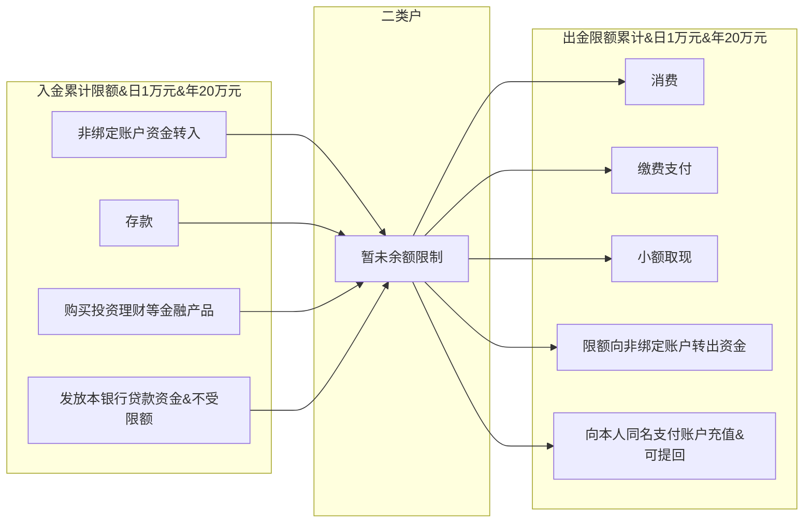
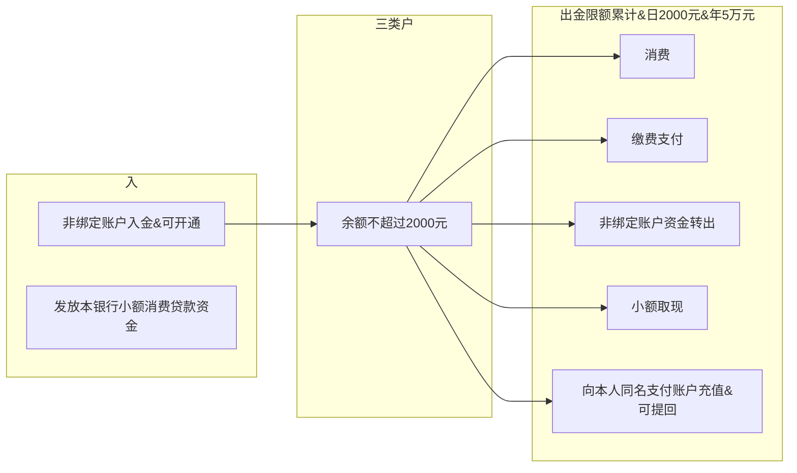

## 《关于改进个人银行账户分类管理有关事项的通知》
银发〔2018〕16 号

[http://www.gov.cn/xinwen/2015-12/25/content_5027998.htm](http://www.gov.cn/xinwen/2015-12/25/content_5027998.htm)

#### 开立、变更和撤销相关规定：
* 个人在银行柜面开立的Ⅱ、Ⅲ类户，无需绑定Ⅰ类户或者信用卡账户进行身份验证；
* 通过电子渠道开立Ⅱ类户的，银行应通过绑定开户申请人的同名Ⅰ类户（简称绑定账户）作为核验开户申请人身份信息的手段之一；

#### 入金、余额和出金相关规定：
* **Ⅲ类户任一时点账户余额不得超过2000元**；
* **Ⅲ类户非绑定账户资金转出等出金日累计限额合计为2000元，年累计限额合计为5万元**；
* Ⅱ类户与绑定账户的资金划转限额由银行与存款人协商确定；
* 银行为个人非面对面开立的Ⅱ、Ⅲ类户向本人同名支付账户充值的，充值资金可提回Ⅱ、Ⅲ类户，但提现金额不得超过该Ⅱ、Ⅲ类户向支付账户的原充值金额；
* 除充值资金提回外，支付账户不得向Ⅱ、Ⅲ类户入金，但允许非绑定账户入金的Ⅱ、Ⅲ类户除外；
* 同一家银行通过电子渠道非面对面方式为同一个人只能开立一个允许非绑定账户入金的Ⅲ类户。

|功能|Ⅰ类户|Ⅱ类户|Ⅲ类账|
|-|-|-|-|
|消费|&radic;|&radic;限定金额|&radic;限定金额|
|缴费支付|&radic;|&radic;限定金额|&radic;限定金额|
|存款|&radic;|&radic;||
|购买投资理财等金融产品|&radic;|&radic;||
|转账|&radic;|||
|支取现金|&radic;|&radic;限定金额|&radic;限定金额|

