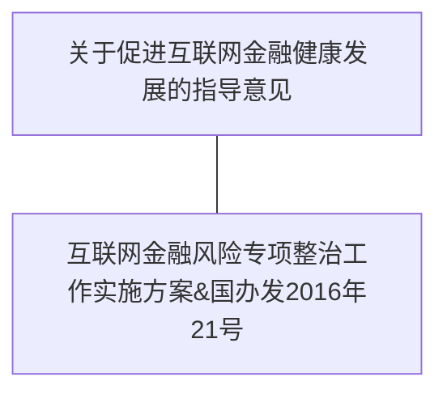

## 互联网金融相关政策

## 互联网金融相关业务
* P2P网络借贷
* 股权众筹

## 《互联网金融风险专项整治工作实施方案》
国办发〔2016〕21号
#### P2P网络借贷
* 不得设立资金池；
* 不得发放贷款；
* 不得非法集资；
* 不得自融自保、代替客户承诺保本保息、期限错配、期限拆分、虚假宣传、虚构标的；
* 不得通过虚构、夸大融资项目收益前景等方法误导出借人；
* 除信用信息采集及核实、贷后跟踪、抵质押管理等业务外，不得从事线下营销；

#### 股权众筹
* 不得发布虚假标的；
* 不得自筹；
* 不得“明股实债”或变相乱集资；
* 应强化对融资者、股权众筹平台的信息披露义务和股东权益保护要求；
* 不得进行虚假陈述和误导性宣传；

#### 第三方支付业务
* 非银行支付机构不得挪用、占用客户备付金；
* 人民银行或商业银行不向非银行支付机构备付金账户计付利息；
* 非银行支付机构不得连接多家银行系统，变相开展跨行清算业务；

## 支付宝和快捷支付
#### 最开始的担保交易流程：
1. 买家下单
2. 将钱打入一个由银行托管的第三方账户（淘宝网在银行的对公户）；
3. 淘宝网收到买家的付款信息后，通知卖家发货；
4. 在买家收到货物并确认收货后，淘宝网将钱打给卖家；

