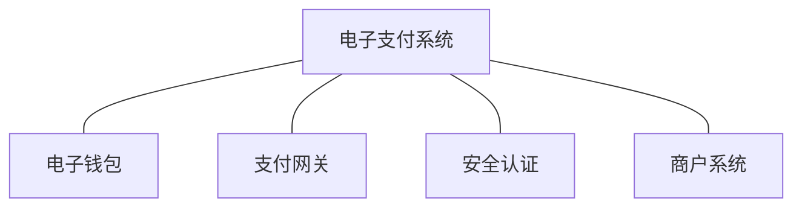

## 电子支付的系统组成

#### 支付网关
是银行金融系统和互联网之间的接口，是连接银行内部网络与互联网的一组服务器，其主要作用是完成两者之间的通信、协议转换和进行数据加密、解密。

*****
## 网上银行支付

网上银行支付需跳转到银行的页面进行支付，支付时输入的是这家银行的网银密码。

#### 网上银行支付基本流程：
1. 买家下单；
2. 商家接受订单，向网上银行发送订单金额；
3. 银行在验证商家身份后，给商家提供支付链接；
4. 商家将支付链接传给买家，买家在核对完网上银行界面的支付信息后，填入自己的支付卡号，密码进行支付；
5. 银行检验用户的支付卡有效后，把货款从客户账户转到商家账户，并向商家网站返回支付成功消息；
6. 商家向买家发送支付成功消息；

*****
## 网关支付
起源于线上网上银行支付场景合并。网银没有统一的页面进行展现，因此银联等第三方支付公司将主流银行的网银嵌入自己的支付网关内，供外部商户使用。

#### 网关支付2.0
随着PC时代的逐渐消亡，手机市场的快速崛起，对于传统的网上银行支付已经不能满足手机移动支付的边界、快速有效，因此在原先的网关支付的基础上分别进化出了WAP无卡支付和PC无卡支付，就是通过验证银行卡要素信息后，完成线上支付，相比原先的网上银行支付插入U盾，输入密码等一系列操作而言明显大大提高了支付的便利性，期间也有叫法为认证支付1.0。

*****
## 快捷支付
支付宝通过逐一与银行签约谈判，形成一张快捷支付的完整网络，也为支付宝奠定了线上移动支付的宝座。
快捷支付首先需要与发卡银行认证用户姓名，身份证，卡号，预留手机号，有效期或者CVN2，并绑定在支付账户上以实现用户一键绑定卡支付；绑定以后支付时只需输入第三方支付的支付密码或者是支付密码加上手机动态口令即可完成支付。
* 快捷支付按百分比收费，快捷扣款要有协议号；
* 代扣按笔收费，额度大，校验的要素少，包括姓名，身份证号，银行卡号；

#### 免密协议支付
为了满足用户定期购买货币基金，定期购买理财的用户群体，协议支付在用户许可的情况下，允许支付机构自动完成免密从绑定卡中扣除约定金额资金进行购买；免密协议支付是必须基于支付账户为主体，在开立支付账户和绑定银行卡时已经约定清楚了相关的责任和义务，再次基础上用户进行了授权以完成协议支付。

* 协议支付与传统代扣本质上的区别，就是在于账基和卡基，协议支付是基于支付账户完成的协议约定，而代扣则是以某张特定的银行卡为约定要素进行支付

