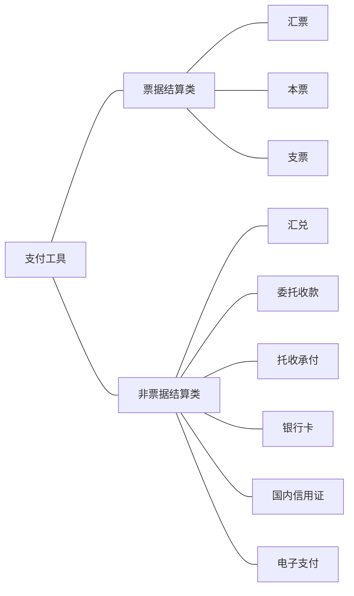
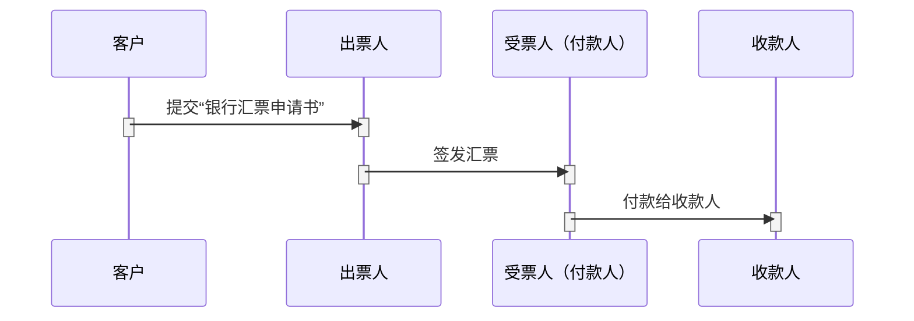
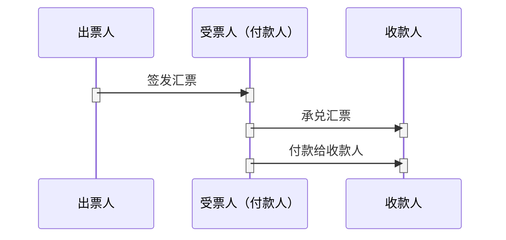

支付工具是指由银行或者其它支付机构发行的，能够发起支付指令，用于债务清偿或者资金转移的证件。
<!--more-->

## 支付工具分类

**借记支付工具：**
票据（银行汇票、银行本票、支票）本身签发的时候是要由申请人向银行存入一定的票据金额的，而且该金额是存入银行的相关账户中，比如甲向银行申请开出银行汇票，此时必须有一定的账户资金才能开出，开出银行汇票后，该资金也不是立即就能打入到收款人账户中，而是由收款人在一定时间之后向银行提示付款，此时银行才就该账户的资金予以支付，因此是借记支付工具，类似于信用卡中的借记卡。
**贷记支付工具：**
汇兑、委托收款和托收承付结算方式是没有资金存入银行的专门账户中，而是直接由付款人直接将款项打入到收款人账户中，没有收款人提示付款这个环节，因此看成是一种贷记支付工具。类似信用卡贷记卡。

## 汇票
汇票是出票人签发的，委托付款人在见票时或者在指定日期无条件支付确定的金额给收款人或者持票人的票据。汇票分为银行汇票和商业汇票。
*****
汇票的特点：
* 汇票有即期和远期之分；
* 汇票作为支付工具的同时，还可作为信贷工具；

#### 银行汇票：

* 出票人：是指签发汇票的银行；
* 受票人（付款人）：是指受出票人委托支付票据金额的人；
* 收款人：是指从银行提取汇票所汇款项的单位和个人；

*****
#### 商业汇票：
商业汇票分为商业承兑汇票和银行承兑汇票。

商业汇票特点：
* 适用范围相对银行汇票较窄，各企业、事业单位之间只有根据购销合同进行合法的商品交易，才能签发商业汇票；
* 使用对象相对较少，使用商业汇票的收款人、付款人以及背书人、被背书人等必须同时具备两个条件：一是在银行开立存款账户，二是具有法人资格。

* 出票人：为签发汇票的付款工商企业或收款人；若是银行承兑汇票，则只能由付款的工商企业进行签发；
* 受票人（付款人）：可由银行或付款的工商企业承兑汇票；

## 本票
是由银行签发的，承诺自己在见票时无条件支付确定的金额给收款人或者持票人的票据。分为定额和不定额两种。

## 支票
是出票人签发，委托办理支票存款业务的银行在见票时无条件支付确定的金额给收款人或持票人的票据。支票包括转账、现金、普通支票三种。支票可以理解为一种特殊的汇票。

支票的特点：
* 支票均为见票即付；

## 银行卡

#### 信用卡
是指商业银行向个人和单位发行的，凭以向特约单位购物、消费和向银行存取现金，且具有消费信用的特制载体卡片。
按使用对象分为单位卡和个人卡；按信誉等级分为金卡和普通卡。

## 汇兑

## 委托收款

## 托收承付

## 国内信用证

