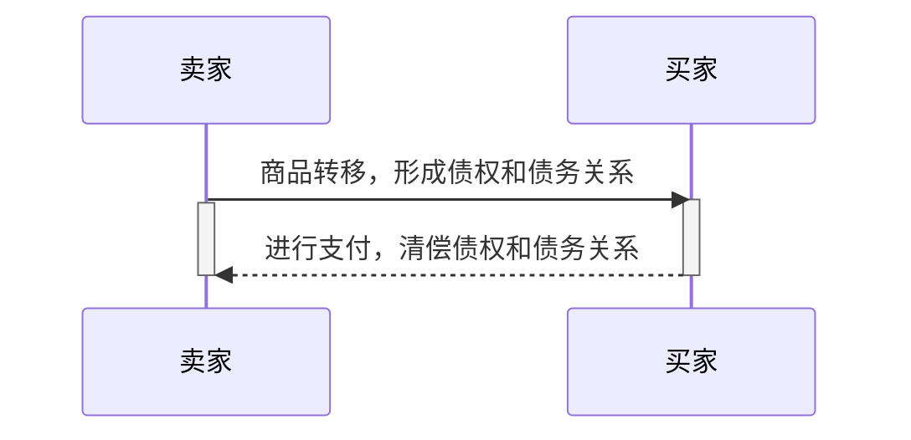
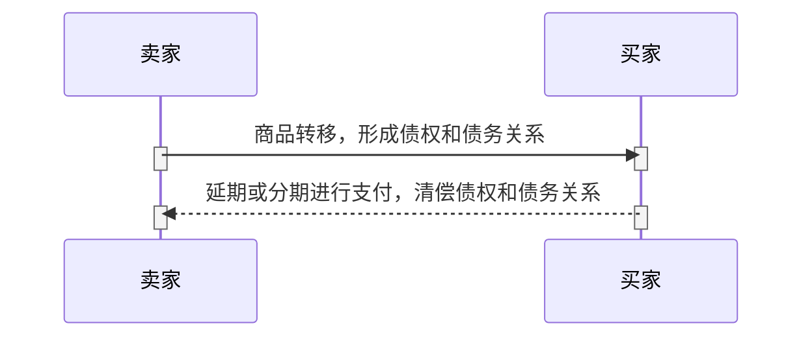

## 支付的本质
支付产生于交易，交易的存在是支付发生的前提。
*****

## 支付的基本模型

#### 买卖交易类型：



在这个交易过程中：
* 商品从卖家转移到买家，完成商品所有权的转移，形成债权和债务关系；
* 买家通过现金或其它方式完成支付，清偿此债务，交易过程完成。
*****
#### 基于商业信用的交易类型：
当卖家和买家建立了牢固的信用关系后，可基于信用进行交易。这种信用称为商业信用，其基本形式是赊销商品和预付货款。



特点：
* 商业信用提供的对象是企业再生产总资本的一部分。
* 企业为了使再生产连续进行，不能长期将资本借出，商业信用一般只适用于短期借贷。


*****
#### 基于银行信用的交易类型：
银行信用是银行和各类金融机构以货币形式提供的信用。银行信用是在商业信用基础上产生和发展起来的。

```mermaid

sequenceDiagram
    participant 卖家
    participant 买家
    participant 银行
    买家->>银行:进行借款，形成债权和债务关系
    activate 买家
    activate 银行
    deactivate 买家
    deactivate 银行
    卖家->>买家: 商品转移，形成债权和债务关系
    activate 买家
    activate 卖家
    买家->>卖家:进行支付，清偿债权和债务关系
    deactivate 买家
    deactivate 卖家
    银行->>买家:收回借款，清偿债权和债务关系
    activate 买家
    activate 银行
    deactivate 银行
    deactivate 银行

```

## 支付结算概念
是指单位、个人在社会经济活动中进行货币给付及资金清算的行为。


