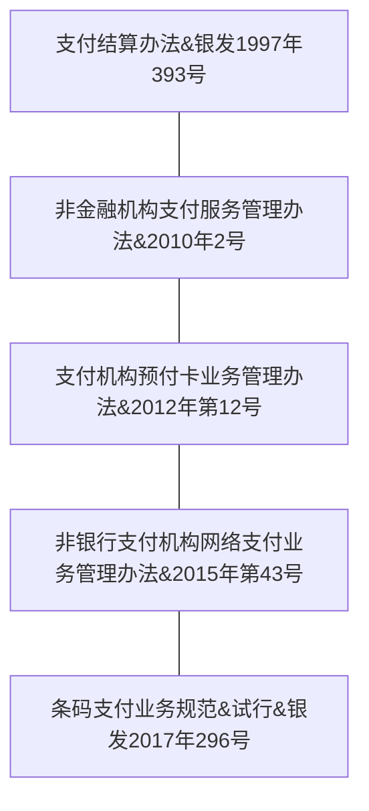
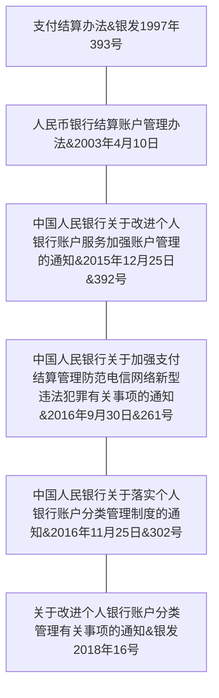

## 《非金融机构支付服务管理办法》
中国人民银行令〔2010〕第2号发布

#### 非金融机构支付服务：
是指非金融机构在收付款人之间作为中介机构提供下列部分或全部货币资金转移服务：
（一）网络支付；
（二）预付卡的发行与受理；
（三）银行卡收单；
（四）中国人民银行确定的其他支付服务。

#### 网络支付：
是指依托公共网络或专用网络在收付款人之间转移货币资金的行为，
包括：
（一）货币汇兑
（二）互联网支付
（三）移动电话支付
（四）固定电话支付
（五）数字电视支付等。

#### 预付卡：
是指以营利为目的发行的、在发行机构之外购买商品或服务的预付价值，包括采取磁条、芯片等技术以卡片、密码等形式发行的预付卡。

#### 银行卡收单：
是指通过销售点（POS）终端等为银行卡特约商户代收货币资金的行为。

#### 非金融支付机构：
非金融机构提供支付服务，应当依据本办法规定取得《支付业务许可证》，成为支付机构。
支付机构依法接受中国人民银行的监督管理。

#### 不得直联：
支付机构之间的货币资金转移应当委托银行业金融机构办理，不得通过支付机构相互存放货币资金或委托其他支付机构等形式办理。
支付机构不得办理银行业金融机构之间的货币资金转移，经特别许可的除外。

#### 支付牌照
央行发放的支付牌照共分为七种支付类型：
* 预付卡受理
* 预付卡发行
* 移动电话支付
* 互联网支付
* 固定电话支付
* 银行卡收单
* 数字电视支付

## 《支付结算办法》
（银发[1997]393号）

#### 中介机构
第六条 银行是支付结算和资金清算的中介机构。未经中国人民银行批准的非银行金融机构和其他单位不得作为中介机构经营支付结算业务。但法律、行政法规另有规定的除外。

## 《条码支付业务规范（试行）》
银发〔2017〕296号

