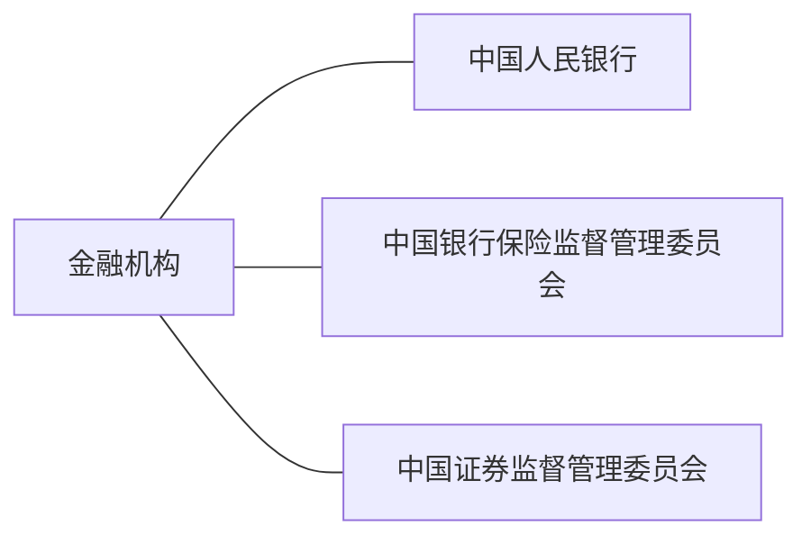
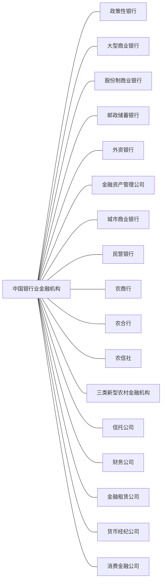

## 金融机构定义
指以货币资金为经营对象，从事货币信用、资金融通、金融交易以及相关业务的组织机构。

*****

## 金融机构分类
通常分为银行与非银行金融机构两大类。

#### 按监管隶属关系分类

```mermaid

graph LR
     金融机构 --- 中国人民银行               
     金融机构 --- 中国银行保险监督管理委员会
     金融机构 --- 中国证券监督管理委员会

```

#### 按银行与非银行业金融机构分类

```mermaid

graph LR
     金融机构 --- 银行业金融机构               
     金融机构 --- 非银行业金融机构

```

```mermaid

graph LR
     中国银行业金融机构 --- 政策性银行
     中国银行业金融机构 --- 大型商业银行
     中国银行业金融机构 --- 股份制商业银行
     中国银行业金融机构 --- 邮政储蓄银行
     中国银行业金融机构 --- 外资银行
     中国银行业金融机构 --- 金融资产管理公司
     中国银行业金融机构 --- 城市商业银行
     中国银行业金融机构 --- 民营银行
     中国银行业金融机构 --- 农商行
     中国银行业金融机构 --- 农合行
     中国银行业金融机构 --- 农信社
     中国银行业金融机构 --- 三类新型农村金融机构
     中国银行业金融机构 --- 信托公司
     中国银行业金融机构 --- 财务公司
     中国银行业金融机构 --- 金融租赁公司
     中国银行业金融机构 --- 货币经纪公司
     中国银行业金融机构 --- 消费金融公司

```

