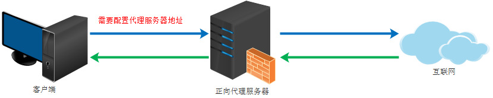
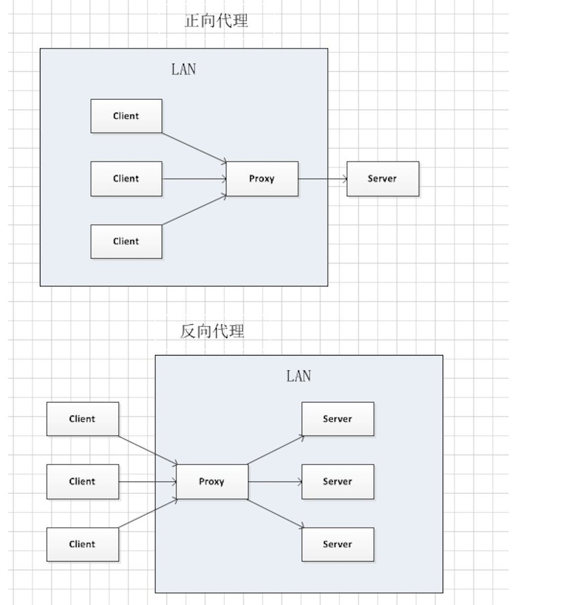

## 一些概念
#### 代理
proxy，也称网络代理，一种网络服务。允许一个网络终端（一般为客户端）通过这个服务与另一个网络终端（一般为服务器）进行非直接的连接。

正向代理的作用：
* 访问原来无法访问的资源
* 可以做缓存，加速访问资源
* 对客户端访问授权，上网进行认证
* 可以记录用户访问记录（上网行为管理），对外隐藏用户信息

#### 反向代理
reverse proxy，指以代理服务器来接受internet上的连接请求，然后将请求转发给内部网络上的服务器，并将从服务器上得到的结果返回给internet上请求连接的客户端。

反向代理的作用：
* 保证内网的安全，可以使用反向代理提供WAF功能，阻止web攻击

*****
正向代理VS反向代理：

* 正向代理中，proxy和client同属一个LAN，对server透明；
* 反向代理中，proxy和server同属一个LAN，对client透明。

#### 代理服务器
proxy server,提供代理服务的电脑系统或其它类型的网络终端称为代理服务器.
#### nginx：
一个高性能的HTTP和反向代理服务器。
